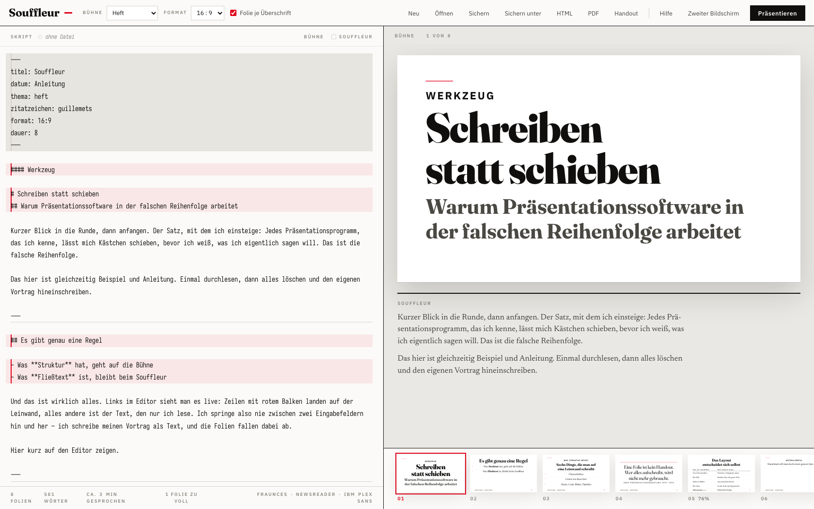
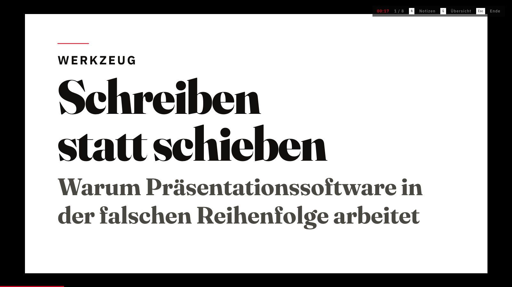
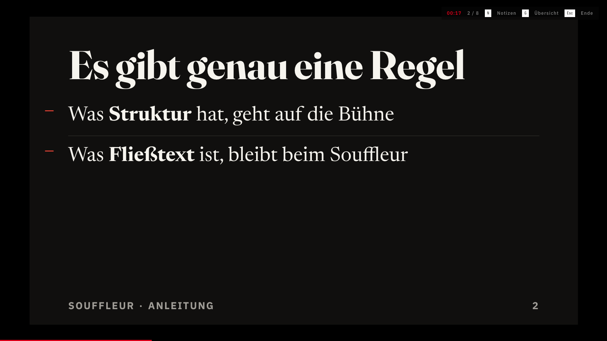
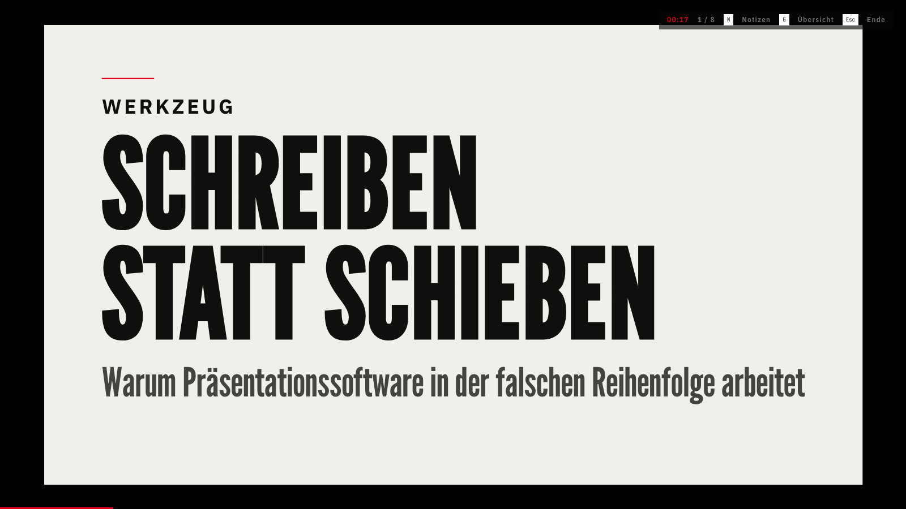
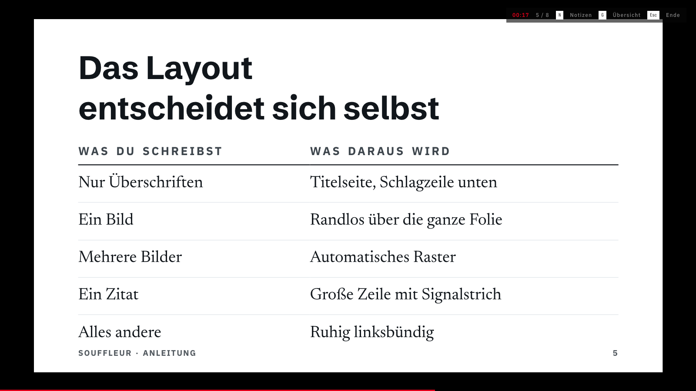

# Souffleur

Most presentations are ugly, and it is rarely the fault of the person giving
them. The software hands out design decisions nobody asked for: not just where
the boxes go, but which font, which heading level, which hierarchy. That is the
wrong way round. A talk is content and focus, and the tool should be taking
those decisions off the table rather than adding to them.

So Souffleur does not offer any. You write one Markdown document. What has
structure goes on the slide, what is prose becomes the line you speak. The
typesetting is settled in advance and the text is fitted for you.

One HTML file, no dependencies, no build step, nothing to install:

```
open souffleur.html
```

[](docs/app.png)

<p align="center">
  <a href="docs/heft.png"></a>
  <a href="docs/kontra.png"></a>
  <a href="docs/plakat.png"></a>
  <a href="docs/professional.png"></a>
</p>

## What it does

- Slides and speaker notes out of one file, split by the rule below
- Four themes, set on a root-two type scale, chosen in the front matter
- Text shrinks to fit the slide and says so when a slide is too full
- Presenter view on a second screen: current slide, next slide, notes, clock
- PDF at slide size, and an A4 handout that sets the spoken text at a 128 mm
  measure, with the outer margin left free for notes during the meeting
- German microtypography: quotes per house style, hyphenation where text is
  read and nowhere else, en dash for the dash
- Files open and are written back in place, with no copy in the download folder

## The one rule

Headings, lists, quotes, code, images and tables go on the slide. Every other
paragraph becomes a note. Three or more hyphens on their own line start a new
slide, and so does every level 1 or level 2 heading.

Two ways out, for when the rule does not fit:

```markdown
! Dieser Absatz steht auf der Folie, obwohl er Fließtext ist.

// - Diese Liste bleibt Notiz, obwohl sie Struktur hat
```

Front matter carries the rest: `thema`, `format`, `titel`, `datum`, `dauer`,
`zitatzeichen`. Keys and values both take English spellings, so `theme:
magazine` works as well as `thema: heft`.

The full reference is in the app, not here. Open `Hilfe`, or `Anleitung laden`
for an annotated example that doubles as the manual.

## Fonts

Six roles are held by placeholder names and fall through to free faces:
Fraunces, Newsreader, IBM Plex Sans, Iosevka, League Gothic and Schibsted
Grotesk. They are not in this repository, so a fresh clone falls back to system
fonts until you install them. The screenshots above show the free set.

To bind your own without touching the code:

```
cp fonts.local.example.js fonts.local.js
git config core.hooksPath .githooks
```

That file is gitignored, and the hook flags font bindings in tracked files. The
example explains why binding goes through the PostScript name and not the
family name.

## Status

Alpha. The typesetting, the PDF and the handout are checked by hand in all four
themes. There is no test suite, and the second screen and dropping images into
the editor are not covered by automated checks.

Known gaps. The interface, the help and the sample document are German, and the
document language is nailed to German, so an English deck hyphenates by the
wrong rules. Embedded images live in the browser's local storage rather than in
the Markdown file, so they do not travel with it; only the HTML export carries
them along. Writing back to a file needs the File System Access API, which in
practice means Chromium today. Elsewhere `Sichern` leaves a copy in the download
folder. Nothing here has been tested outside Chromium.

There is no import from `.pptx`, `.key` or Google Slides, and no command line.

It is one file. The typesetting lives in the `<style id="app-css">` block, the
parser in `parse`, `inline` and `renderBlock`. Issues and pull requests are
welcome. I cannot promise a roadmap.

## Credits

- The six faces above, each under the SIL Open Font License.
- The look owes a debt to German magazine typography, brand eins above all.

[MIT](LICENSE)
